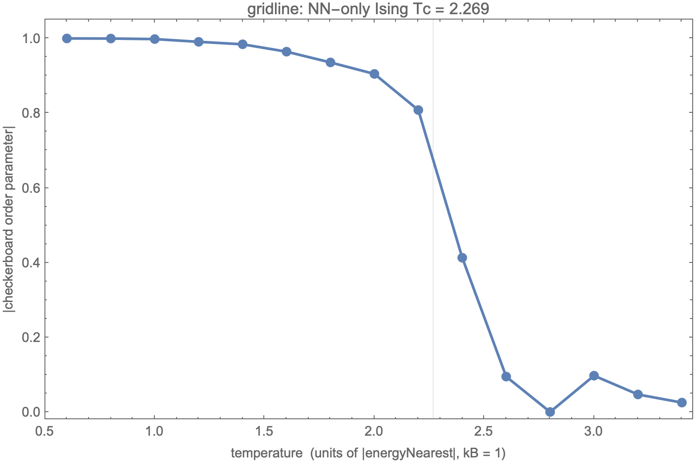
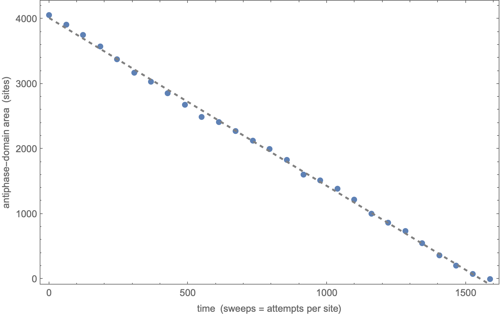
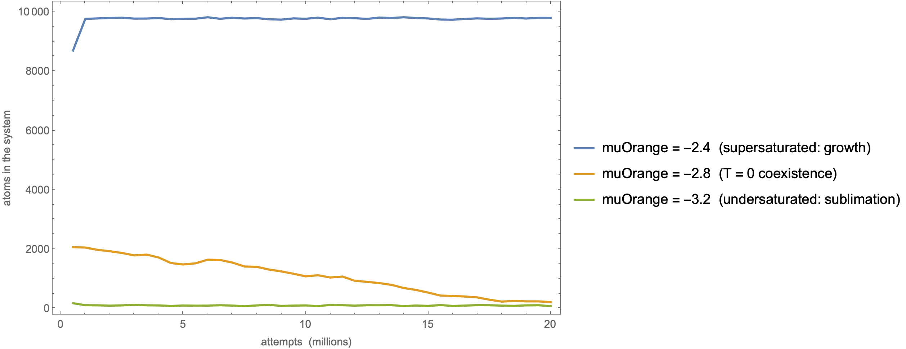
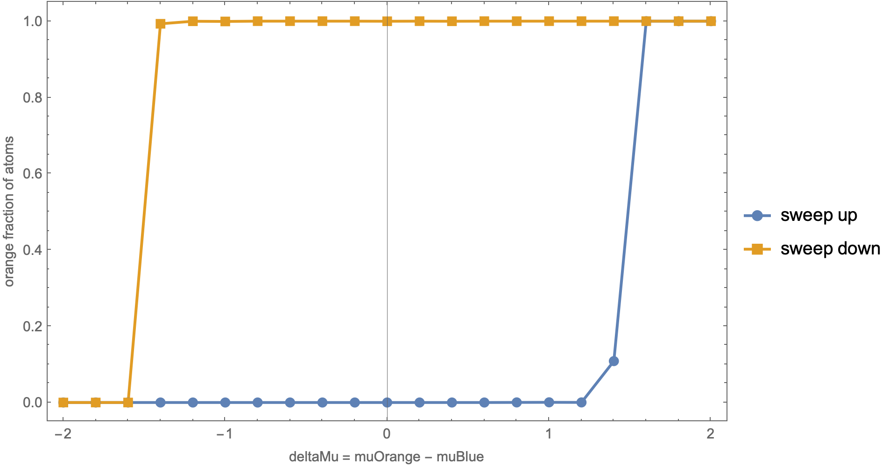

# Phenomena Observable with the Lattice-Gas Metropolis Tool

This is a field guide: each entry names a phenomenon the simulation can
display, explains the physics briefly, and gives a tested recipe — the tool,
the parameters, and the process. Quantitative claims below were verified with
[`phenomena_checks.wls`](phenomena_checks.wls), which also regenerates every
figure in `figures/`.

**The model in one paragraph.** Each site of an N × M square lattice holds an
orange atom (+1), a blue atom (−1), or a vacancy (0). Neighboring sites
interact with energy $e\,s_i s_j$ — $e =$ `energyNearest` for the four N,S,E,W
neighbors, `energyNextNearest` for the four diagonal neighbors — so like
pairs cost $+e$, unlike pairs $-e$, and vacancies are inert. The lattice has
free (rectangular) boundaries. Two samplers share this model: the **kinetic
tool** (`latticeGasMetropolisSweep`: vacancy-mediated and/or direct switches,
plus optional atom exchange with a gas reservoir *at the surface only*) and
the **bulk tool** (`latticeGasBulkExchangeSweep`: any site may change
identity; fastest route to equilibrium, no kinetics). Units: energies in
units of $|$`energyNearest`$|$, temperature $T = 1/$`inverseTemperature`
with $k_B = 1$.

**Ground-state cheat sheet** (which phase wins, from the per-site bond
energies):

| Phase | Condition |
|---|---|
| decomposition (orange-rich + blue-rich) | `energyNearest` < 0 |
| checkerboard | `energyNearest` > 0 and `energyNextNearest` < `energyNearest`/2 |
| stripes | `energyNextNearest` > `energyNearest`/2 > 0 |

---

## 1. Phase separation and spinodal decomposition

**What you see.** Quenched from a random mixture with attractive like-bonds,
the lattice spontaneously separates into orange-rich and blue-rich domains.
A deep quench at near-symmetric composition gives the classic bicontinuous,
interconnected spinodal pattern; strongly asymmetric composition gives
droplets of the minority phase instead.

**Why.** With `energyNearest` < 0, like pairs are bound and unlike pairs cost
energy — a miscibility gap. Inside the spinodal region the mixture is
unstable to infinitesimal composition fluctuations, so separation proceeds
everywhere at once (no nucleation barrier), selecting an interconnected
morphology at ~50/50 composition.

**Recipe.** Either tool. `energyNearest` → −1, `energyNextNearest` → −0.4,
`inverseTemperature` → 1.5, `muOrange` = `muBlue` → 1. Start from
`latticeGasRandomConfiguration[200, 200, 16000, 16000]` and just run. For
droplet (nucleation-like) morphology instead, use the kinetic tool with
`exchangeProbability` → 0 and an asymmetric start (e.g. 6000 orange, 26000
blue): conserved composition pins the volume fractions (the lever rule), so
the minority phase must form islands.

## 2. Coarsening (domain growth)

**What you see.** After separation, the domain pattern is not static: small
domains shrink, large ones grow, and the characteristic length increases —
forever, on any finite lattice, until one domain per phase remains.

**Why.** Interfaces carry free energy, and the total interface length can
only decrease. With conserved composition (kinetic tool, no exchanges),
material must diffuse from high-curvature to low-curvature regions, giving
slow growth (the Lifshitz–Slyozov $R \sim t^{1/3}$ class); non-conserved
dynamics (bulk tool) coarsens much faster (the Allen–Cahn $R \sim t^{1/2}$
class — see §4 for the cleanest version).

**Recipe.** Parameters of §1; watch with the configuration view. To compare
transport mechanisms, run the kinetic tool twice at the same parameters:
`occupiedSwitchFrequency` → 0 (pure vacancy-mediated, physical substitutional
kinetics — slower at low vacancy content) vs equal frequencies (direct
exchange allowed — faster). The equilibrium end state is identical; only the
clock changes.

## 3. The order–disorder transition (checkerboard)

**What you see.** With unlike-favoring nearest-neighbor bonds, cooling
through a critical temperature transforms a disordered solid solution into
checkerboard order. The phase-map view is the clearest witness: gray
(disordered) gives way to red/green ordered domains as T drops.

**Why.** Checkerboard order is the square-lattice antiferromagnet. For
`energyNearest` = 1, `energyNextNearest` = 0 and a dense lattice, this is
exactly the 2D Ising model, whose exact critical temperature is
$T_c = 2/\ln(1+\sqrt{2}) \approx 2.27$. A negative `energyNextNearest`
(like diagonals favored — which checkerboard satisfies) pushes $T_c$ up.

**Verified.** Cooling a 64 × 64 lattice at `energyNearest` = 1,
`energyNextNearest` = −0.2, `muOrange` = `muBlue` = 1.5 gives a sharp rise of
the global staggered order parameter between T ≈ 2.6 and T ≈ 2.2
(|OP| = 0.10 → 0.41 → 0.81), consistent with $T_c$ slightly above the
NN-only value:

**Recipe.** Bulk tool, parameters above; sweep `inverseTemperature` from
~0.3 to ~1.7 (T from 3.4 down to 0.6), giving the system ~10⁷ attempts per
step. In the widget: drag the temperature slider slowly downward and watch
the phase map. Quench *fast* instead and you get §4's antiphase domains.

## 4. Antiphase domains and curvature-driven wall motion (Allen–Cahn)

**What you see.** A rapid quench into the checkerboard phase nucleates order
in the two registries (B-O-B-O vs O-B-O-B) in different places; where they
meet, antiphase boundaries form. The walls then move toward their centers of
curvature: enclosed domains shrink and vanish. A circular antiphase domain
shrinks with its **area decreasing linearly in time** — the signature of
interface velocity ∝ curvature ($v = -M\kappa \Rightarrow dA/dt = -2\pi M$,
independent of radius).

**Why.** The order parameter is not conserved (a registry flip needs no mass
transport), so walls move locally to reduce interfacial energy — the
Allen–Cahn law. This is the pedagogical opposite of §2's conserved
coarsening.

**Verified.** A radius-36 antiphase disk in a 128 × 128 checkerboard
(`energyNearest` = 1, `energyNextNearest` = −0.2, `inverseTemperature` = 1.5,
`muOrange` = `muBlue` = 1.5, bulk tool) shrinks from 4060 sites to zero in
~1590 sweeps with area(t) fit by $4013 - 2.59\,t$ — linear over the whole
lifetime:

**Recipe.** Construct the initial state directly (flip the registry inside a
disk by negating the spins there — see `phenomena_checks.wls`), or just
quench from random and watch the polydomain structure evolve; the phase-map
view shows the red/green domains and their gray walls. Registries are
degenerate, so which one survives is a coin flip — run it twice.

## 5. Stripe phases: orientation and registry domains

**What you see.** With unlike-favoring bonds at *both* ranges
(`energyNextNearest` > `energyNearest`/2 > 0), like atoms line up in rows or
columns. A quench produces a maze of vertical- and horizontal-stripe domains,
each additionally in one of two registries — four degenerate variants, all
distinguished in the phase-map view (turquoise/yellow, saturated = vertical,
light = horizontal).

**Why.** The stripe ground state beats checkerboard when the diagonal
"unlike" preference dominates: per site, checkerboard costs
$-2 e_1 + 2 e_2$ and stripes cost $-2 e_2$, so stripes win for
$e_2 > e_1/2$. Fourfold degeneracy means both orientation domains
(90° walls) and antiphase domains (registry walls) appear, and both coarsen
by the §4 mechanism.

**Recipe.** Bulk tool: `energyNearest` → 1, `energyNextNearest` → 1,
`inverseTemperature` → 1.5, `muOrange` = `muBlue` → 1; quench from random,
200 × 200, ~3 × 10⁷ attempts. Try `energyNextNearest` just above and just
below `energyNearest`/2 to watch the checkerboard–stripe competition.

## 6. Equilibrium vacancy concentration (Arrhenius law)

**What you see.** A dense single-species crystal in equilibrium with its gas
carries a small, temperature- and μ-dependent population of vacancies,
appearing and disappearing at random in the bulk.

**Why.** Removing a bulk atom costs its binding energy minus what the gas
pays: $E_f = \mu + |h_{\text{bulk}}|$, with
$h_{\text{bulk}} = 4\,e_1 + 4\,e_2 = -5.6$ for $e_1 = -1$, $e_2 = -0.4$. The
equilibrium vacancy fraction is $c_v \approx e^{-\beta E_f}$.

**Verified.** All-orange 100 × 100 lattice, bulk tool,
`inverseTemperature` = 1: measured mean vacancy numbers 16.7 / 10.4 / 5.9 /
3.8 at `muOrange` = 1.0 / 1.5 / 2.0 / 2.5, against the prediction
$10^4 e^{-(\mu + 5.6)}$ = 13.6 / 8.3 / 5.0 / 3.0. The exponential slope in μ
is reproduced exactly; the uniform ~20% excess comes from the free boundary,
where vacancy formation is cheaper than the bulk estimate.

**Recipe.** As above; count with `latticeGasSpeciesCounts`. Repeat at two
temperatures to extract the formation energy from an Arrhenius plot.

## 7. Interfacial vacancy wetting (a premelting analogue)

**What you see.** In a phase-separated two-species state, lowering both
chemical potentials toward zero makes vacancies condense *first* along the
orange/blue domain walls — a thin film that thickens into channels as μ
drops further, while the bulk stays dense.

**Why.** A vacancy's formation energy is (bonds broken) − μ. At an interface
the bonds are already half-wrong, so the local formation energy reaches zero
before the bulk's does: the interface is always the first place to "melt."
This is the lattice analogue of grain-boundary premelting/wetting.

**Recipe.** Take a §1 decomposed configuration and slowly lower `muOrange` =
`muBlue` from 1 toward 0 (and slightly below) at `inverseTemperature` = 1.5,
watching the configuration and occupancy views. The repository's own demo
figures show the two ends: μ = 1 (light decoration) vs μ = 0 (wetted
channels).

## 8. Crystal–vapor equilibrium: growth, sublimation, Gibbs–Thomson

**What you see.** Use one species only and the vacancy state becomes vapor:
an orange droplet (crystallite) surrounded by empty lattice. Depending on
`muOrange`, the droplet grows atom by atom at its perimeter, roughly holds,
or sublimes away.

**Why.** The T = 0 coexistence chemical potential equals the bulk binding
energy per atom, $\mu_{\text{coex}} = 2e_1 + 2e_2 = -2.8$ for
$e_1 = -1, e_2 = -0.4$. Above it the vapor is supersaturated and the crystal
grows; below it the crystal sublimes. A *finite* droplet of radius $r$ needs
extra supersaturation $\propto \sigma/r$ to survive (Gibbs–Thomson), so at
coexistence-level μ a small droplet still evaporates.

**Verified.** Radius-25 droplet, 100 × 100, `inverseTemperature` = 1.5,
`muBlue` = −6 (blue suppressed): after 2 × 10⁷ attempts the atom count goes
1963 → 9792 at `muOrange` = −2.4 (growth to fill the box), → 211 at −2.8
(sublimation of a subcritical droplet at nominal coexistence — Gibbs–Thomson
plus the finite-T shift), → 74 at −3.2 (fast sublimation):

**Recipe.** As above with the bulk tool. With the kinetic tool
(`exchangeProbability` > 0) the same physics happens only via the lattice
boundary: a crystal filling the frame evaporates from the surface inward, or
grows outward — surface-limited kinetics. Note the μ values here are below
the widget's current slider floor of −1; extend the slider range to ~−4 for
this demo.

## 9. First-order transition and hysteresis in Δμ

**What you see.** In the phase-separating system, sweeping the chemical
potential difference $\Delta\mu = \mu_O - \mu_B$ across zero should flip the
equilibrium state from all-blue to all-orange at $\Delta\mu = 0$ — but the
simulation flips late, at a finite |Δμ|, and at a *different* point on the
way back: a hysteresis loop, the hallmark of a first-order transition with
metastability.

**Why.** Deep in the miscibility gap, converting blue to orange requires
nucleating an orange droplet against its interfacial cost. Small Δμ gives a
critical nucleus too large to appear in the available time, so the
metastable phase persists until the driving force overwhelms the barrier.

**Verified.** 64 × 64, `energyNearest` = −1, `energyNextNearest` = −0.4,
`inverseTemperature` = 1, base μ = 1, bulk tool, 2 × 10⁶ attempts per step,
Δμ stepped by 0.2: the up-sweep stays blue until flipping between
Δμ = +1.4 and +1.8; the down-sweep stays orange until −1.4 to −1.8 — a loop
of full width ≈ 3:

**Recipe.** As above. The loop narrows at higher T, with slower sweeps, or
with a free surface helping nucleation — all worth showing. (Equilibrium,
found by patience or by starting from mixed states, is a *vertical* jump at
Δμ = 0.)

## 10. Ergodicity, frozen dynamics, and why vacancies matter

**What you see.** A perfectly dense two-species lattice with
`occupiedSwitchFrequency` = 0 and no gas exchange does absolutely nothing —
not slow dynamics: *zero* possible moves. Add a single vacancy and the whole
lattice comes alive, reorganizing through that one wandering defect.

**Why.** Substitutional diffusion in a dense crystal requires a defect
mechanism; with direct atom–atom exchange switched off (the physically
realistic setting), the vacancy is the only carrier of mobility. This is
ergodicity made visible — and a vivid statement of why real crystals need
point defects to evolve.

**Verified.** 30 × 30 dense lattice, 10⁶ attempts: statistics report zero
attempted moves of any kind and the configuration is bit-identical
afterward. The same lattice with one vacancy: 328,773 accepted vacancy
switches in the same 10⁶ attempts.

**Recipe.** Kinetic tool, `exchangeProbability` → 0,
`occupiedSwitchFrequency` → 0, dense configuration (note
`latticeGasRandomConfiguration` deliberately always leaves ≥ 1 vacancy; build
a truly dense lattice by hand as in `phenomena_checks.wls`). For the
one-vacancy show, a small lattice (≤ 50 × 50) keeps the single defect's
random walk visible on screen.

## 11. Surface phenomena with the kinetic tool

Qualitative recipes, all using `exchangeProbability` ≈ 0.1–0.3 so the gas
talks only to the lattice boundary:

- **Evaporation front**: dense mixed crystal, drop both μ well below
  coexistence (e.g. −2 at `inverseTemperature` = 1.5): the crystal sublimes
  from the boundary inward — the interior cannot evaporate directly.
- **Deposition and interdiffusion**: start all-blue and set
  `muOrange` ≫ `muBlue`: orange adsorbs at the boundary ring and then
  diffuses inward (vacancy-mediated if `occupiedSwitchFrequency` = 0),
  forming a diffusion-couple concentration profile that sharpens or spreads
  with temperature.
- **Composition control by the gas**: with both μ moderate, the boundary
  ring equilibrates with the gas first; the interior follows on the slow
  diffusion clock — a nice visualization of surface-limited vs
  diffusion-limited exchange.

---

## Practical notes

- **Widget slider ranges**: the phenomena above need `inverseTemperature`
  spanning ~0.3–2 (T ≈ 0.5–3.4) — covered by a T ∈ [0.1, 5] slider — but
  §8's sublimation physics needs μ down to ≈ −4, below a [−1, 10] slider
  floor.
- **Global order parameters** for plots: composition and occupancy from
  `latticeGasSpeciesCounts`; the staggered sums are one-liners (see
  `checkerboardOrderParameter` in `phenomena_checks.wls`) or spatial
  averages of `latticeGasOrderParameterMaps`.
- **Equilibrium vs kinetics**: every equilibrium claim here is
  tool-independent (both samplers obey detailed balance for the same
  ensemble); every *rate* or *pathway* claim belongs to the kinetic tool
  with `occupiedSwitchFrequency` = 0.
- Re-verify everything after model changes with
  `wolframscript -file phenomena_checks.wls` (~1 minute).
