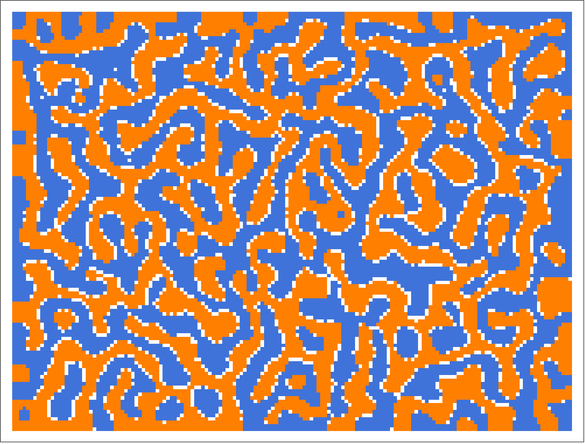
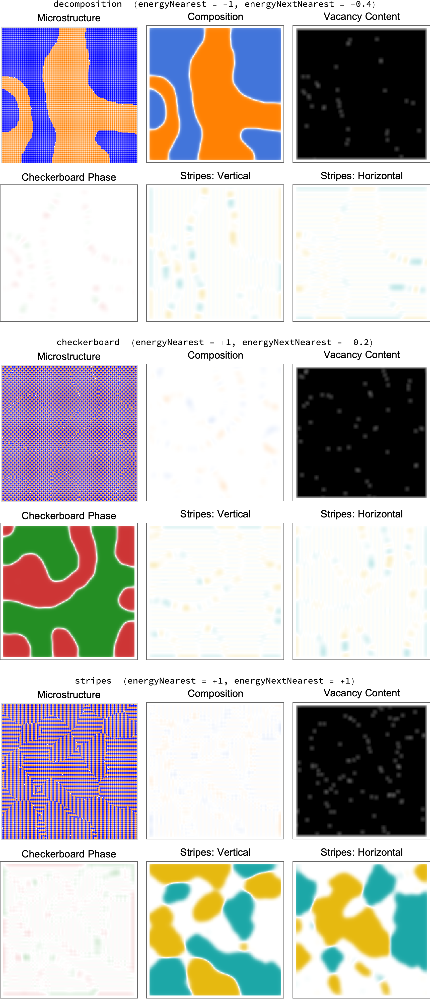
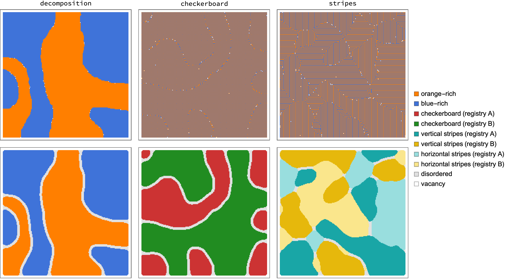

# LatticeGasMC

Metropolis Monte Carlo simulation of a two-species + vacancy lattice gas on an
N × M square lattice with free (rectangular) boundaries, written in Wolfram
Language. The compiled (C-target) kernels run at roughly 60–100 ns per
attempted move (~10⁹ moves per minute) on lattices up to 500 × 500.

The package provides **two simulation tools** that share one configuration
format and one set of measurement/plotting utilities — choose by what you
are studying:

| Tool | Ensemble | Use for |
|---|---|---|
| `latticeGasMetropolisSweep` | canonical, or semi-grand via *surface* exchange | kinetics: coarsening, vacancy-mediated diffusion, surface growth |
| `latticeGasBulkExchangeSweep` | semi-grand via *bulk* exchange (any site can change identity) | equilibrium phase diagrams: decomposition, order/disorder |

Both sample the same semi-grand Boltzmann distribution where they overlap
(verified against exact enumeration), so they may even be alternated on the
same configuration; the bulk tool simply gets to equilibrium far faster
because it does not need mass transport.



*Demo: 120 × 160 lattice after 5 × 10⁷ moves with attractive like-atom bonds —
orange and blue domains coarsening, with a light decoration of vacancies at
the domain boundaries and atom exchange with the gas at the free boundary.
Regenerate with `readme_demo.wls`.*

## Model

Each site holds an orange atom (+1), a blue atom (−1), or a vacancy (0).
Neighboring sites interact through their four first (N, S, E, W) and four
second (diagonal) nearest neighbors:

```math
E \;=\; e_{1}\sum_{\langle ij\rangle} s_i s_j \;+\; e_{2}\sum_{\langle\langle ij\rangle\rangle} s_i s_j
```

where $e_1$ = `energyNearest` and $e_2$ = `energyNextNearest`. Because of the
spin encoding, the product $s_i s_j$ gives exactly the intended chemistry:
$+e$ for a like pair, $-e$ for an unlike pair, and 0 whenever a vacancy is
involved. All of the energetics therefore reduce to sums over a site's eight
neighbors (its *site enthalpy* $h$) — no pattern tables are needed, and the
energy change of any move costs a handful of multiply–adds.

Three kinds of moves. Each attempt is a surface exchange with probability
`exchangeProbability`; otherwise it is a switch, drawn from one of two
disjoint classes:

- **Vacancy switch** (vacancy-mediated diffusion): a vacancy — drawn
  uniformly from a maintained list of vacancy positions — trades places with
  one of its eight neighbors, provided that neighbor is an atom. Accepted
  with the Metropolis probability $\min(1, e^{-\beta\,\Delta E})$ where, in
  terms of the site enthalpies $h$ of the two sites,
  $\Delta E = (s_a - s_b)\left[(h_b - J_{ab}\,s_a) - (h_a - J_{ab}\,s_b)\right]$.
- **Occupied switch** (direct exchange): an atom — drawn uniformly from a
  maintained list of atom positions — trades places with a neighboring atom
  of the other species. A vacancy neighbor is *not* eligible; that channel
  belongs exclusively to the vacancy class, so the two frequencies below
  mean exactly what they say.
- **Surface exchange with a gas reservoir** (semi-grand ensemble): a site on
  the outermost lattice ring exchanges an atom with an infinite reservoir at
  fixed chemical potentials `muOrange`, `muBlue`. A surface site and a
  species $s$ are drawn uniformly; an atom of species $s$ is removed
  ($\Delta E = \mu_s - s\,h$) or inserted onto a vacancy
  ($\Delta E = s\,h - \mu_s$). The proposal is symmetric, so Metropolis
  acceptance satisfies detailed balance with stationary weight
  $\exp[-\beta\,(E - \mu_O n_O - \mu_B n_B)]$.

The switch class is chosen with probability proportional to
`vacancySwitchFrequency` × (number of vacancies) versus
`occupiedSwitchFrequency` × (number of atoms), so every vacancy and every
atom carries its own attempt frequency independent of composition
(kinetic-Monte-Carlo-style bookkeeping); only the ratio of the two
frequencies matters. Both switch types leave the vacancy and atom counts
unchanged, so the class-selection weights are identical before and after any
switch and detailed balance is exact — the frequencies change the *kinetics*,
never the equilibrium.

Typical settings: `"occupiedSwitchFrequency" -> 0` for physical,
vacancy-mediated kinetics (real substitutional diffusion; note that at least
one vacancy is then needed for anything to move when exchanges are off);
equal frequencies for fastest equilibration when only equilibrium states
matter. With `"exchangeProbability" -> 0` the simulation is canonical (fixed
composition, diffusion only); with a positive value the lattice equilibrates
with the gas.

**The bulk-exchange tool** (`latticeGasBulkExchangeSweep`) drops the
kinetic constraints entirely: each attempt picks *any* real site uniformly
and proposes changing its identity to one of the other two states
{orange, blue, vacancy}, each with probability ½ — a symmetric proposal, so
Metropolis acceptance on

```math
\Delta E \;=\; (s_\text{new} - s_\text{old})\,h \;-\; (\mu_\text{new} - \mu_\text{old}),
\qquad \mu_\text{vacancy} = 0
```

is exact. This one formula covers insertion, removal, and direct
orange ↔ blue transmutation. Nothing is conserved, and the stationary
distribution is the same semi-grand ensemble as above — but with no mass
transport required, equilibration is orders of magnitude faster, which is
what you want when mapping decomposition and order/disorder phase diagrams
as functions of (μ_orange, μ_blue, T).

**Free boundaries** are implemented by storing configurations zero-padded: an
(N+2) × (M+2) integer matrix whose outer frame is permanently 0. Since a bond
to 0 contributes zero energy, the frame *is* the free surface — the kernel
needs no boundary branches and no periodic `Mod` arithmetic. Switches that
would move an atom into the frame are rejected, which preserves detailed
balance.

**Site lists.** The vacancy and atom position lists are rebuilt by one
O(N·M) scan at the start of each kernel call (negligible, amortized over the
call's many attempts) and maintained in O(1) per accepted move. Besides
making the frequencies exact, the lists make the dilute-vacancy regime
efficient: with 0.5% vacancies and vacancy-only switching, every attempt
lands on a vacancy, where uniform site selection would waste 99.5% of
attempts.

## Files

| File | Purpose |
|---|---|
| `LatticeGasMC.wl` | The package: compiled MC kernels plus setup, measurement, order-parameter, and plotting utilities |
| `test_lgmc.wls` | Validation suite and benchmarks (`wolframscript -file test_lgmc.wls`) |
| `order_parameter_demo.wls` | Regenerates `order_parameters.png` and `phase_maps.png` from three simulated microstructures |
| `readme_demo.wls` | Regenerates `demo.png`, the header figure |

## Usage

```wolfram
Get["LatticeGasMC.wl"];

configuration = latticeGasRandomConfiguration[200, 300, 12000, 12000];
Dynamic[latticeGasConfigurationPlot[configuration, ImageSize -> 500]]

Do[
  {configuration, statistics} = latticeGasMetropolisSweep[configuration, 10^6,
    "energyNearest" -> -1.0, "energyNextNearest" -> -0.4,
    "inverseTemperature" -> 2.0,
    "muOrange" -> -0.5, "muBlue" -> -0.5,
    "exchangeProbability" -> 0.1],
  {200}]

latticeGasTotalEnergy[configuration, -1.0, -0.4]   (* exact total energy *)
latticeGasSpeciesCounts[configuration]
```

Do many moves per `latticeGasMetropolisSweep` call (10⁵–10⁷) and redraw
between calls; the top-level call overhead and plotting cost are then
negligible.

For phase-diagram work, use the bulk tool and scan the chemical potentials
(the configuration equilibrates from any starting point — kinetics play no
role):

```wolfram
isothermData = Table[
   configuration = latticeGasRandomConfiguration[100, 100, 3000, 3000];
   {configuration, statistics} = latticeGasBulkExchangeSweep[
     configuration, 2*10^7,
     "energyNearest" -> -1.0, "energyNextNearest" -> -0.4,
     "inverseTemperature" -> 2.0, "muOrange" -> mu, "muBlue" -> -mu];
   {mu, latticeGasSpeciesCounts[configuration],
    latticeGasTotalEnergy[configuration, -1.0, -0.4]},
   {mu, -1.0, 1.0, 0.1}];
```

### Functions

- `latticeGasRandomConfiguration[nRows, nColumns, nOrangeAtoms, nBlueAtoms]`
  — random zero-padded configuration with exact species counts.
- `latticeGasMetropolisSweep[configuration, nAttempts, opts]` — run
  `nAttempts` Metropolis attempts; returns `{newConfiguration, statistics}`
  where `statistics` counts attempted/accepted vacancy switches,
  attempted/accepted occupied switches, attempted exchanges, and accepted
  insertions and removals. Options: `"energyNearest"`,
  `"energyNextNearest"`, `"muOrange"`, `"muBlue"`, `"inverseTemperature"`,
  `"exchangeProbability"`, `"vacancySwitchFrequency"`,
  `"occupiedSwitchFrequency"` (both frequencies default to 1). All
  parameters are runtime arguments — changing them never triggers
  recompilation.
- `latticeGasMetropolisSweepCore[configuration, energyNearest,
  energyNextNearest, muOrange, muBlue, inverseTemperature,
  exchangeProbability, vacancySwitchFrequency, occupiedSwitchFrequency,
  nAttempts]` — fixed-argument form of `latticeGasMetropolisSweep` for
  tight loops.
- `latticeGasBulkExchangeSweep[configuration, nAttempts, opts]` — the
  phase-diagram tool: run `nAttempts` bulk identity-change attempts; returns
  `{newConfiguration, statistics}` where `statistics` counts attempted and
  accepted bulk exchanges, the latter also broken down by final state
  (orange / blue / vacancy). Options: `"energyNearest"`,
  `"energyNextNearest"`, `"muOrange"`, `"muBlue"`, `"inverseTemperature"`.
- `latticeGasBulkExchangeSweepCore[configuration, energyNearest,
  energyNextNearest, muOrange, muBlue, inverseTemperature, nAttempts]` —
  fixed-argument form of `latticeGasBulkExchangeSweep` for tight loops.
- `latticeGasBondSums[configuration]` — exact integer bond sums
  `{bondSumNearest, bondSumNextNearest}`, so the energy is their dot product
  with `{energyNearest, energyNextNearest}`, with no floating-point drift —
  and saved configurations can be re-scored under new parameters for free.
- `latticeGasTotalEnergy[configuration, energyNearest, energyNextNearest]` —
  total lattice energy.
- `latticeGasSpeciesCounts[configuration]` — species and vacancy counts.
- `latticeGasConfigurationPlot[configuration, opts]` — `ArrayPlot` of the
  real sites (orange / blue / white).
- `latticeGasOrderParameterMaps[configuration, smoothingRadius]` — local
  order-parameter fields identifying which phase is present where (see
  *Order parameters* below).
- `latticeGasOrderParameterPlot[configuration, smoothingRadius, opts]` —
  the configuration beside its five order-parameter maps.
- `latticeGasPhaseMap[configuration, smoothingRadius, orderThreshold]` —
  classifies every site by its dominant order parameter (integer codes;
  see *Order parameters*).
- `latticeGasPhaseMapPlot[configuration, smoothingRadius, orderThreshold,
  opts]` — legended false-color plot of the phase map; pass
  `"Legend" -> False` and add `latticeGasPhaseMapLegend[]` once when
  assembling multi-panel figures.

Conventions: orange = +1, blue = −1; real sites of a padded configuration are
`configuration[[2 ;; -2, 2 ;; -2]]`; M ≥ 3 is required.

## Order parameters

The NN + NNN couplings support three ordered phases, and each is detected by
a **local staggered order parameter**: multiply the spin field by the
phase's characteristic sign pattern, then smooth over a window a few lattice
constants wide (Gaussian, radius `smoothingRadius`). Because each phase
lives at a different wavevector, the maps are mutually orthogonal — each
phase registers on exactly one map:

| Phase | Sign pattern | Map |
|---|---|---|
| decomposition (orange/blue-rich regions) | $1$ | `"composition"` $= \langle s\rangle$ |
| checkerboard (unlike NN, like NNN) | $(-1)^{i+j}$ | `"checkerboard"` |
| vertical stripes (like-atom columns) | $(-1)^{j}$ | `"stripeVertical"` |
| horizontal stripes (like-atom rows) | $(-1)^{i}$ | `"stripeHorizontal"` |

plus `"occupancy"` $= \langle|s|\rangle \in [0,1]$ for vacancy-rich regions
(divide `"composition"` by `"occupancy"` for the composition *among atoms*).

Each signed map lies in $[-1, 1]$, and the sign encodes the **registry**:
antiphase domains (patterns offset by one cell) appear as regions of
opposite sign, with antiphase boundaries visible as the zero-crossings
between them. Orientation domains of the stripe phase appear as
complementary regions of the two stripe maps. `order_parameters.png`
(regenerated by `order_parameter_demo.wls`) shows all three microstructures
with their maps:



Rules of thumb: choose `smoothingRadius` larger than the unit cell and
smaller than the domain size (the default 8 suits domains tens of cells
across); values within one radius of the boundary are damped by the free
edge. Ground-state energetics per site select the phase: decomposition wins
for `energyNearest` < 0, checkerboard for `energyNearest` > 0 with
`energyNextNearest` < `energyNearest`/2, stripes for
`energyNextNearest` > `energyNearest`/2 > 0.

**Phase map.** For lectures, `latticeGasPhaseMapPlot` condenses the five
maps into one panel: each site is colored by whichever order parameter
dominates locally — orange/blue for composition-rich regions, red/green for
the checkerboard registries, turquoise/yellow for the stripe registries
(saturated for vertical stripes, light for horizontal) — with gray where no
order parameter reaches
`orderThreshold` (default 0.4) and white where the occupancy is below ½.
Domain walls appear as thin gray (disordered) bands between colored
domains:



## Validation

`test_lgmc.wls` checks the kernel end to end:

1. **Exact-distribution test** — on a 2 × 3 lattice, all 3⁶ = 729 states are
   enumerated and the exact semi-grand Boltzmann distribution is compared
   with a long simulation run at *unequal* switch frequencies; the
   total-variation distance (~0.03 for 10⁵ samples) sits at the pure
   sampling-noise floor, and ⟨E⟩, ⟨n_orange⟩, ⟨n_blue⟩ agree to 3–4 digits —
   confirming the frequencies alter kinetics but not the equilibrium. A
   3 × 3 test (3⁹ states) repeats the moment comparison with *purely
   vacancy-mediated* switching and exercises every branch of the
   surface-site indexing.
2. **Conservation and list bookkeeping** — with `"exchangeProbability" -> 0`,
   species counts are exactly conserved and the zero frame is never written;
   over 10⁷ moves in a single kernel call with all move types active, the
   change in atom count exactly equals accepted insertions minus accepted
   removals.
3. **Bulk-tool exact-distribution tests** — the same 2 × 3 and 3 × 3
   enumeration comparisons are repeated for `latticeGasBulkExchangeSweep`,
   confirming that both tools sample the identical semi-grand ensemble.
4. **Order-parameter maps** — perfect synthetic patterns (uniform,
   checkerboard, both stripe orientations) give exactly ±1 on their own map
   and < 0.02 crosstalk on the others; the phase map classifies a
   four-quadrant synthetic pattern correctly, labels random configurations
   disordered, and labels empty regions vacancy.
5. **Benchmarks** — ~83 ns per attempt at 500 × 500 with equal switch
   frequencies; ~98 ns with 0.5% vacancies and vacancy-only switching (where
   every attempt lands on a vacancy); ~61 ns for the bulk-exchange tool.

These tests validate the ΔE formulas, the proposal symmetry, and the
acceptance rule jointly, so they are a good regression gate after any kernel
change.

## Requirements

- Mathematica / Wolfram Language 12+ (developed on 14.0)
- A C compiler for `CompilationTarget -> "C"` (falls back to the Wolfram
  virtual machine, ~10× slower, if none is found)
